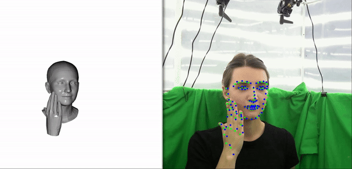
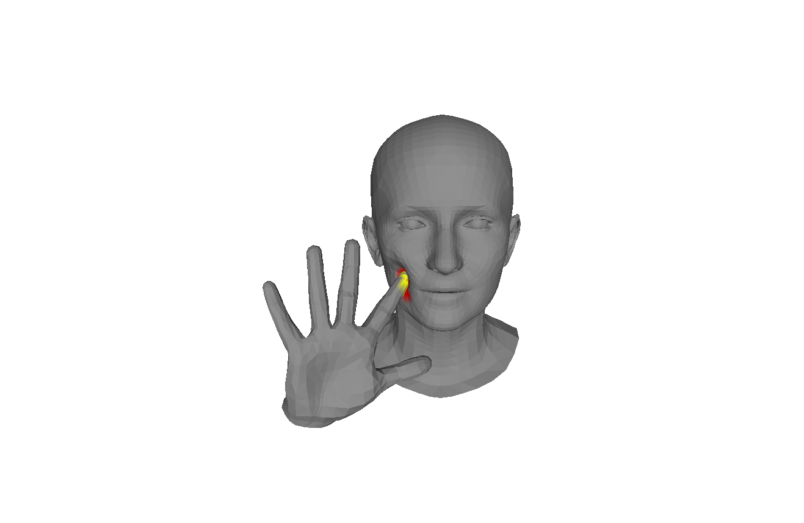
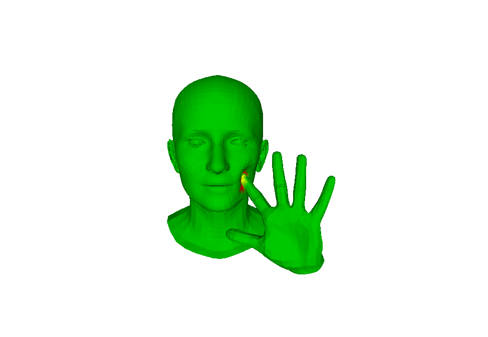
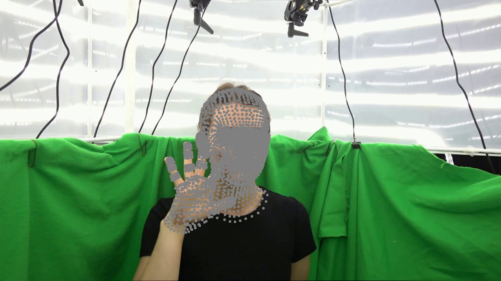
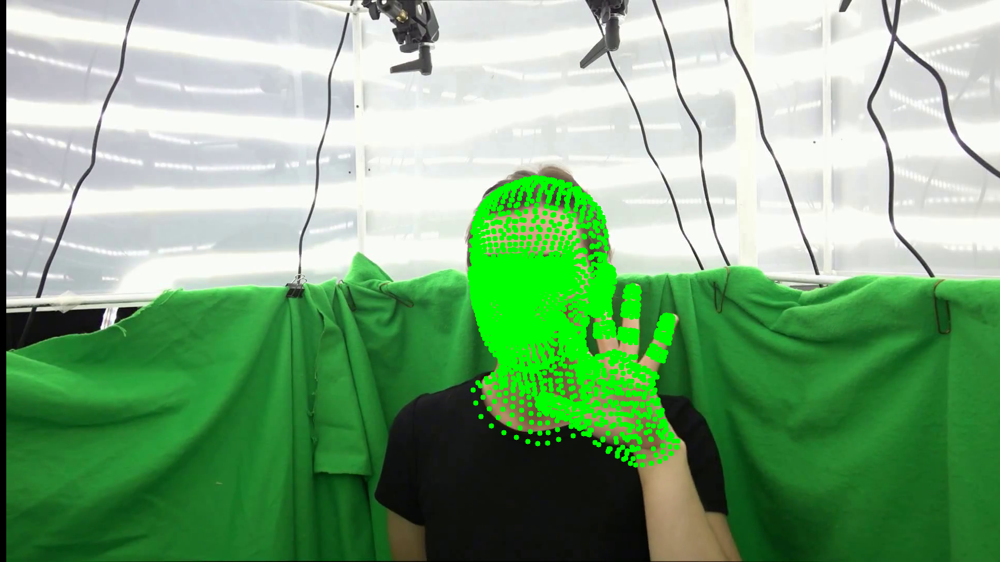
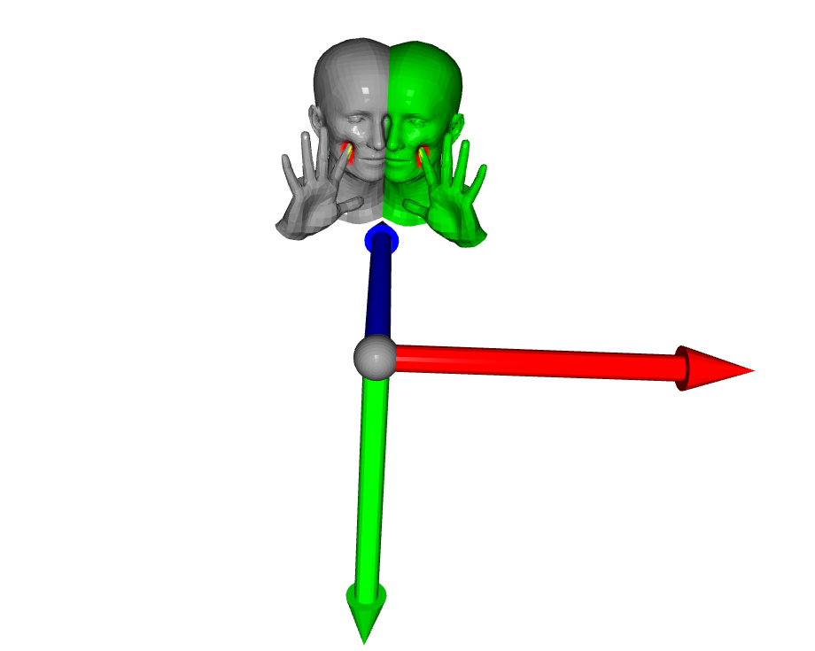
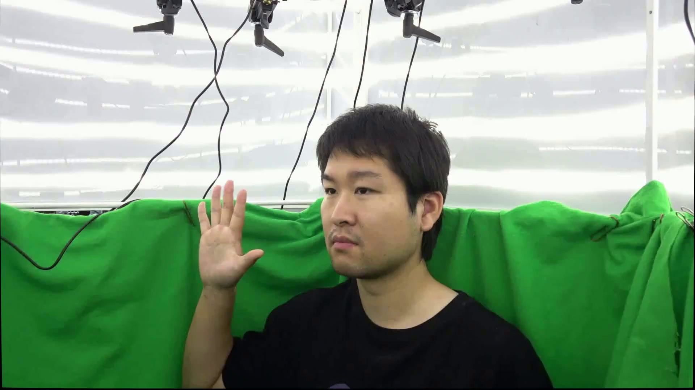
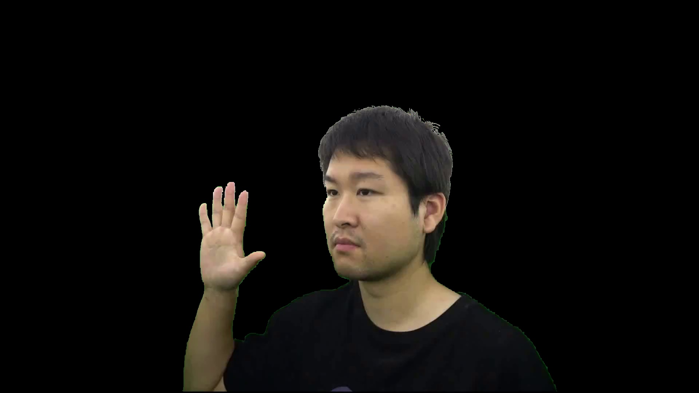

 

# Dataset: "Decaf: Monocular Deformation Capture for Face and Hand Interactions"  [SIGGRAPH Aisa '23](https://vcai.mpi-inf.mpg.de/projects/Decaf/).   
   
Authors: Soshi Shimada, Vladislav Golyanik, Patrick Pérez, Christian Theobalt 

<p align="center">
  
</p>


This is the official repository of Decaf dataset:

* **3D deformations:** per-vertex 3D deformations for [FLAME head model](https://flame.is.tue.mpg.de/index.html).
* **Contacts:** per-vertex contact signals for head and hand.
* **2D key points:** 2D keypoints obtained from [MediaPipe](https://developers.google.com/mediapipe) for a head and for a hand [face_alignment](https://github.com/1adrianb/face-alignment).
* **2D bounding box:** bounding box for a head and for a hand. 
* **Parameters:** multi-view fitting results from our studio recording, applicable to both the  [FLAME](https://flame.is.tue.mpg.de/index.html) head model and  [MANO](https://mano.is.tue.mpg.de/) hand model.
* **RGB Video:** multi-view RGB recordings captured in our studio.
* **Segmentation mask:** corresponding foreground masks for the RGB videos obtained using [Background Matting](https://github.com/senguptaumd/Background-Matting).
* **camera parameters:** intrinsic, extrinsic and distortion parameters for the cameras.
* **CutID:** Identifiers for frames where the video is cut to exclude invalid frames. For instance, [(1619, 1620), (2989, 2990)] indicates that the video (along with all corresponding deformations, parameters, keypoints, and parameters) is cut at frames 1619 and 1620, and again between frames 2989 and 2990, resulting in non-consecutive segments.


## Download
The dataset can be downloaded from [here]().
## Dataset Visualization Script Setup 
Clone the repo:
  ```bash
  git clone https://github.com/soshishimada/DecafDatasetScript
  cd DecafDatasetScript
  ```  

### Requirements
* Python 3.7
* PyTorch tested version 1.12.1+cu113
* PyTorch3d tested version 0.7.2 
* MANO pytorch implementation from [here](https://github.com/otaheri/MANO).
1) To install the dependencies other than PyTorch and Pytorch3d, you can run:
    ```bash
    pip install -r requirements.txt&&pip install git+'https://github.com/otaheri/MANO'
    ```
    &nbsp;&nbsp;&nbsp;&nbsp;Or use conda environment:
    ```bash
    bash install_conda.sh
    ```
    
2) For installing the same versions of torch and pytorch3D as the ones we used, you can run the command below. Please see their [official page](https://pytorch3d.org/) for more details.  
    ```bash
    pip install torch==1.12.1 --index-url https://download.pytorch.org/whl/cu113&&git clone https://github.com/facebookresearch/pytorch3d.git&&cd ./pytorch3d&&git checkout tags/v0.7.2&&pip install -e .&&cd..
    ```

## Example scripts
1) After downloading the dataset (DecafDataset), place the head and hand model under "DecafDataset/assets":
    *  Download "FLAME 2020" from [here](https://flame.is.tue.mpg.de/index.html). Extract and place "generic_model.pkl" under assets folder.
    * Download the mano hand model "mano_v1_2" from [here](https://mano.is.tue.mpg.de/index.html). Place it under assets folder.
    * Get "landmark_embedding.npy" from [here](https://github.com/yfeng95/DECA/tree/master/data). Place it under assets folder.
    
    Now the folder should look like this:
    ```bash
    DecafDataset/
    ├── assets/
    │   ├── left_right_face_corresps.pkl
    │   ├── generic_model.pkl
    │   ├── landmark_embedding.npy
    │   ├── mano_v1_2
    │   └── FLAME_neck_idx.npy
    ├── test
    └── train
    ```
2) For the online visualization of the dataset, run:
    ```bash
    python src/visualizer.py --dataset_path /PATH/TO/DATASET --vis_con 0 --vis3d 1 --vis2d 1 --show_every 5
    ``` 
    The example below shows the image sequence with keypoints overlay. Green keypoints are from 2D keypont detectors and blue keypoints are projected points of the 3D face and hand.  
    
    * --vis_con: visualization of contacts on a face and a hand.  
    * --show_every: visualize the data every n frames.  
    * --vis3d: visualization in 3D  
    * --vis2d: visualization in 2D

<p align="center">
 
</p> 
 
<br>

3) Example of how to flip deformations, contacts and images for data augmentation:

    ```bash
    python src/flipping_data.py --dataset_path /PATH/TO/DATASET --save_path ./results/flip/ --vis_3d 1
    ```
    The original and flipped data will be saved under the path specified by --save_path option.

 

<p align="center">
   
   
</p> 
<p align="center">
 <em>Original 3D mesh with deformation + contacts.&nbsp;&nbsp;&nbsp;&nbsp&nbsp;&nbsp;&nbsp;&nbsp&nbsp;&nbsp;&nbsp;&nbsp;Flipped 3D mesh with deformation + contacts.</em>
</p>  
<p align="center">
  
  
</p> 
<p align="center">
 <em>Original 3D mesh with deformation + contacts.&nbsp;&nbsp;&nbsp;&nbsp&nbsp;&nbsp;&nbsp;&nbsp&nbsp;&nbsp;&nbsp;&nbsp;Flipped 3D mesh with deformation + contacts.</em>
</p>  
  
<p align="center">
  
</p> 
<p align="center">
 <em>Turn on --vis_3d  option for the interactive 3D visualization.</em>
</p>

4) Example of how to apply masking on an image:
    ```bash
    python src/get_masked_image.py --dataset_path /PATH/TO/DATASET --save_path ./results/mask/
    ```  

 

<p align="center">
  
  
</p> 
<p align="center">
 <em>Original image&nbsp;&nbsp;&nbsp;&nbsp&nbsp;&nbsp;&nbsp;&nbsp&nbsp;&nbsp;&nbsp;&nbsp;&nbsp;&nbsp;&nbsp;&nbsp&nbsp;&nbsp;&nbsp;&nbsp&nbsp;&nbsp;&nbsp;&nbsp;&nbsp;&nbsp;&nbsp;&nbsp&nbsp;&nbsp;&nbsp;&nbsp&nbsp;&nbsp;&nbsp;&nbsp;&nbsp;&nbsp;&nbsp;&nbsp&nbsp;&nbsp;&nbsp;&nbsp&nbsp;&nbsp;&nbsp;&nbsp;&nbsp;&nbsp;&nbsp;&nbsp&nbsp;&nbsp;&nbsp;&nbsp&nbsp;&nbsp;&nbsp;&nbsp;&nbsp;&nbsp;&nbsp;&nbsp&nbsp;&nbsp;&nbsp;&nbsp&nbsp;&nbsp;&nbsp;&nbsp;Masked image</em>
</p>  
<br> 

5) Example of how to obtain consecutive data ids:
    ```bash
    python src/get_consecutive_ids.py --dataset_path /PATH/TO/DATASET  
    ``` 


## License Terms
Permission is hereby granted, free of charge, to any person or company obtaining a copy of this dataset and associated documentation files (the "Dataset") from the copyright holders to use the Dataset for any non-commercial purpose. Redistribution and (re)selling of the Dataset, of modifications, extensions, and derivates of it, and of other dataset containing portions of the licensed Dataset, are not permitted. The Copyright holder is permitted to publically disclose and advertise the use of the software by any licensee. 

Packaging or distributing parts or whole of the provided software (including code and data) as is or as part of other datasets is prohibited. Commercial use of parts or whole of the provided dataset (including code  and data) is strictly prohibited.  

THE DATASET IS PROVIDED "AS IS", WITHOUT WARRANTY OF ANY KIND, EXPRESS OR
IMPLIED, INCLUDING BUT NOT LIMITED TO THE WARRANTIES OF MERCHANTABILITY,
FITNESS FOR A PARTICULAR PURPOSE AND NONINFRINGEMENT. IN NO EVENT SHALL THE
AUTHORS OR COPYRIGHT HOLDERS BE LIABLE FOR ANY CLAIM, DAMAGES OR OTHER
LIABILITY, WHETHER IN AN ACTION OF CONTRACT, TORT OR OTHERWISE, ARISING FROM,
OUT OF OR IN CONNECTION WITH THE DATASET OR THE USE OR OTHER DEALINGS IN THE
DATASET.

## Citation
If the dataset is used, the licensee is required to cite the following publication in any documentation 
or publication that results from the work:
```
@article{
      DecafTOG2023,
      author = {Shimada, Soshi and Golyanik, Vladislav and P\'{e}rez, Patrick and Theobalt, Christian},
      title = {Decaf: Monocular Deformation Capture for Face and Hand Interactions},
      journal = {ACM Transactions on Graphics (TOG)}, 
      month = {dec},
      volume = {42},
      number = {6}, 
      articleno = {264},
      year = {2023}, 
      publisher = {ACM} 
    } 
```
